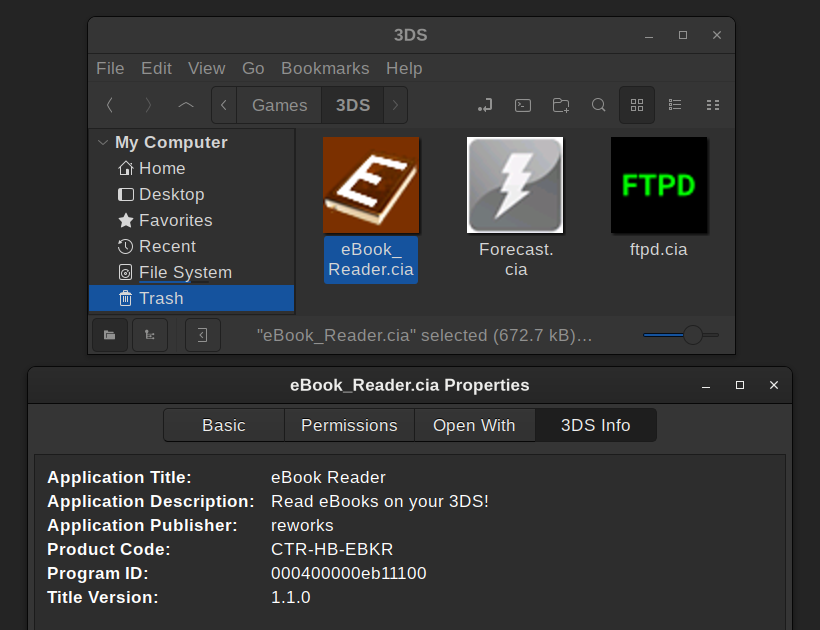

# gnome-3ds-thumbnailer



\*Commerical games require your 3ds `boot9.bin` and `boot11.bin` in `~/.3ds`  
\*Does not work with Nautlius, GNOME's default filebrowser. See note  at bottom
## Installation 
**Requires** [GNOME](https://www.gnome.org/), [nemo](https://github.com/linuxmint/nemo), [pyctr](https://github.com/ihaveamac/pyctr)  
**General info** \[[1](https://askubuntu.com/questions/1368910/how-to-create-custom-thumbnailers-for-nautilus-nemo-and-caja)\]\[[2](https://askubuntu.com/questions/266322/what-additional-thumbnailers-are-available-and-how-do-i-install-them)\]  
**Supported Formats** 3ds, cia, cxi  

## Mimetypes

### Check current mimetypes
 Avoid potential issues from overwriting or duplicating mimetypes. Check your current Nintendo mimetypes with 
* `cat /etc/mime.types | grep nintendo`
* `cat /usr/share/mime/types | grep nintendo` 

### Install mimetypes  
```bash
sudo xdg-mime install --mode system x-nintendo-3ds-cia.xml  
sudo xdg-mime install --mode system x-nintendo-3ds-cxi.xml  
sudo update-mime-database /usr/share/mime  
```  
*my Linux install came with `x-nintendo-3ds-rom` and `x-nintendo-3ds-executable` mimetypes so I didn't create one. Creating one is as simple as copying one of the provided mimetype .xml files and editing the filename, type, and pattern

### Confirm mimetype installation
```bash
xdg-mime query filetype YourRomFile.cia  
> application/x-nintendo-3ds-cia
```

### Install thumbnailer 
```bash
sudo cp gnome-3ds-thumbnailer.thumbnailer /usr/share/thumbnailers/gnome-3ds-thumbnailer.thumbnailer
sudo cp gnome-3ds-thumbnailer.py /usr/bin/gnome-3ds-thumbnailer  
sudo chmod +x /usr/bin/gnome-3ds-thumbnailer.py
```
Delete folder `~/.cache/thumbnails/fail` to allow GNOME to reattempt thumbnail creation of roms  
Close & repopen Nemo / logout & login / Reboot?

---

## Nemo rominfo extension
**Requires** [nemo](https://github.com/linuxmint/nemo), [nemo-python](https://github.com/linuxmint/nemo-extensions/tree/master/nemo-python), [pyctr](https://github.com/ihaveamac/pyctr)  
\* code is mostly from [nemo-mediainfo-tab](https://github.com/linux-man/nemo-mediainfo-tab), GNU GPL 3   
**Supported Formats** 3ds, cia, cci, cxi

```bash
mkdir -p ~/.local/share/nemo-python/extensions  
cp nemo-3dsinfo.py ~/.local/share/nemo-python/extensions/nemo-3dsinfo.py  
```
Enable extension in the plugins section of Nemo's prefences window

---


# Nautilus issue

The thumbnailer works flawlessly with Nemo but using it with GNOME's default file browser, Nautilus, produces no thumbnails and this error

> raise BootromNotFoundError(paths)
> pyctr.crypto.engine.BootromNotFoundError: ['/home/user/.3ds/boot9.bin', '/home/user/.3ds/boot9_prot.bin', '/home/user/3ds/boot9.bin', '/home/user/3ds/boot9_prot.bin']```

The files are present and easily seen by Nemo but not by Nautlius. I don't know how to fix this issue and because I don't use Nautilus I'm not motivated to .